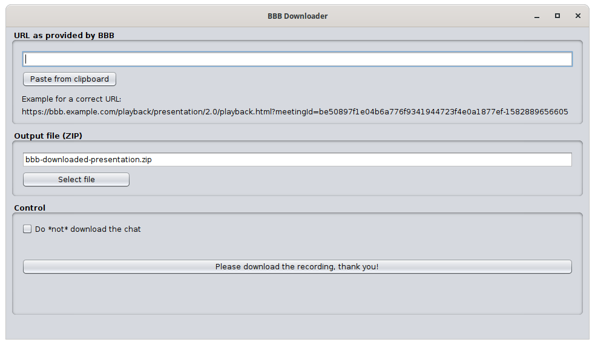

# bbb-downloader
A Java-application to download presentations recorded in BigBlueButton. The tool creates ZIP-archives that contain all necessary files to host the downloaded recordings outside of BigBlueButton.

## Notice on licensing

The code for this project is MIT-licensed. However, note that [src/main/resources/playback.zip](src/main/resources/playback.zip) includes the playback application code from BigBlueButton, which is (L)GPL-licensed, amongst some JavaScript libraries with deviating licenses. Consult the file-headers for the files contained within that archive for licensing information.

The playback code in ``playback.zip`` is a compile of ``bbb-playback`` configured for standalone recordings, as compiled using the procedure described at [https://github.com/bigbluebutton/bbb-playback#standalone-recordings](https://github.com/bigbluebutton/bbb-playback#standalone-recordings).
